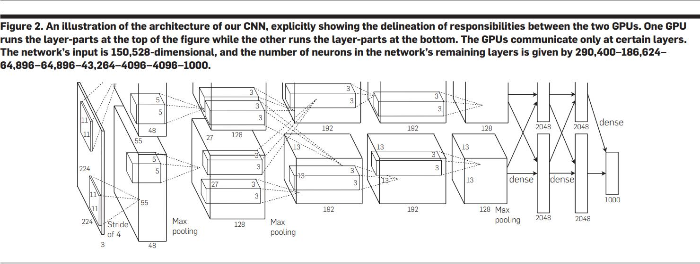
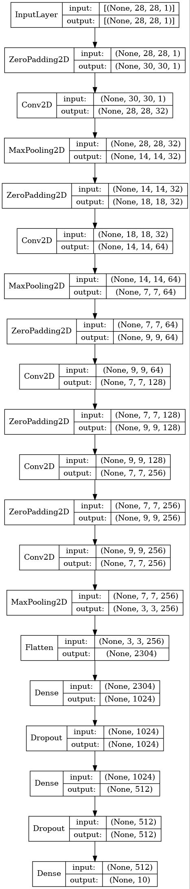
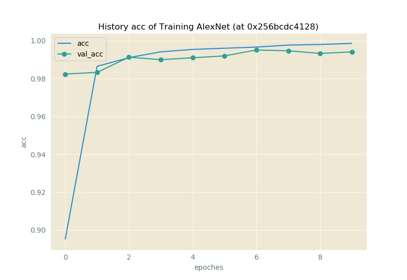
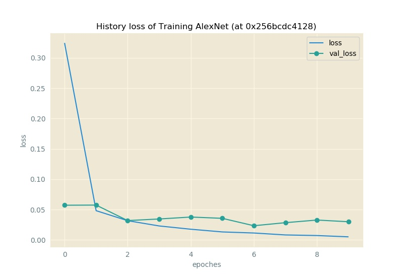
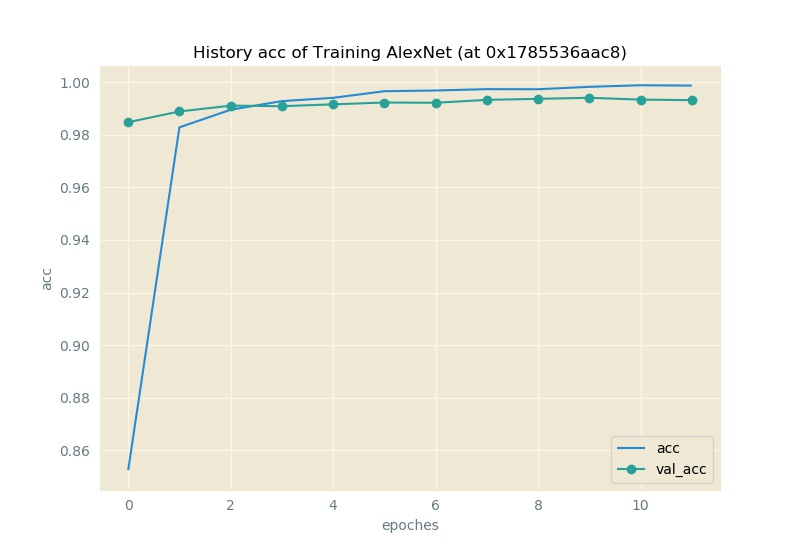
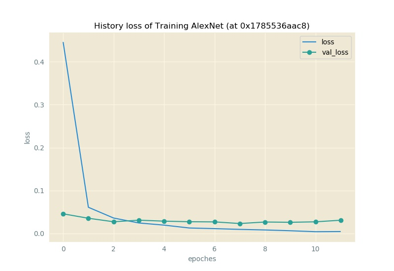

# `AlexNet-Keras`

由 *Alex Krizhevsky, Ilya Sutskever, Geoffrey E. Hinton* 于文献 **ImageNet Classification with Deep Convolutional Neural Networks [^1]** 提出的`convnet`.



于此存放的是, 其基于`tf1 backended Keras`的实现.

## Structure



## Implementation in `Keras`

于此使用`Keras`对其进行复现:

```py Python
alexnet = keras.Sequential([
    keras.layers.ZeroPadding2D(1, input_shape=Constants.INPUT_SHAPE),
    keras.layers.Conv2D(filters=32, kernel_size=3, activation="relu"),
    keras.layers.MaxPool2D(),
    keras.layers.ZeroPadding2D(2),
    keras.layers.Conv2D(64, 5, activation="relu"),
    keras.layers.MaxPool2D(),
    keras.layers.ZeroPadding2D(1),
    keras.layers.Conv2D(128, kernel_size=3, activation="relu"),
    keras.layers.ZeroPadding2D(1),
    keras.layers.Conv2D(256, kernel_size=3, activation="relu"),
    keras.layers.ZeroPadding2D(1),
    keras.layers.Conv2D(256, kernel_size=3, activation="relu"),
    keras.layers.MaxPool2D(pool_size=3, strides=2),
    keras.layers.Flatten(),
    keras.layers.Dense(1024, activation="relu"),
    keras.layers.Dropout(.5),
    keras.layers.Dense(512, activation="relu"),
    keras.layers.Dropout(.5),
    keras.layers.Dense(10, activation="softmax"),
    ], name="AlexNet")
alexnet.compile(
        loss = keras.losses.categorical_crossentropy,
        optimizer = keras.optimizers.Adadelta(),
        metrics = ["accuracy"])
```

## Performance

| `#` | `Keras` version | `TensorFlow` version | `Python` version | Hardware | Training time (/sec) | Testing Loss | Testing Acc |
|-----|-----------------|----------------------|------------------|----------|----------------------|--------------|-------------|
| I | 2.1.6 | 1.11.0 | 3.6.5 | NVIDIA GeForce `MX250` |-| 0.030033850667558114 | 0.994 |
| II | 2.1.6 | 1.11.0 | 3.6.5 | NVIDIA GeForce `MX250` | 478.2904517650604 | 0.030857424439003148 | 0.9932 |

## Output

实验`I`:

```py
Train on 60000 samples, validate on 10000 samples
Epoch 1/10
2022-04-04 20:41:59.339756: I tensorflow/core/platform/cpu_feature_guard.cc:141] Your CPU supports instructions that this TensorFlow binary was not compiled to use: AVX AVX2
2022-04-04 20:42:00.161243: I tensorflow/core/common_runtime/gpu/gpu_device.cc:1411] Found device 0 with properties:
name: GeForce MX250 major: 6 minor: 1 memoryClockRate(GHz): 1.582
pciBusID: 0000:06:00.0
totalMemory: 2.00GiB freeMemory: 1.62GiB
2022-04-04 20:42:00.161635: I tensorflow/core/common_runtime/gpu/gpu_device.cc:1490] Adding visible gpu devices: 0
2022-04-04 20:42:02.399501: I tensorflow/core/common_runtime/gpu/gpu_device.cc:971] Device interconnect StreamExecutor with strength 1 edge matrix:
2022-04-04 20:42:02.399906: I tensorflow/core/common_runtime/gpu/gpu_device.cc:977]      0
2022-04-04 20:42:02.400215: I tensorflow/core/common_runtime/gpu/gpu_device.cc:990] 0:   N
2022-04-04 20:42:02.406078: I tensorflow/core/common_runtime/gpu/gpu_device.cc:1103] Created TensorFlow device (/job:localhost/replica:0/task:0/device:GPU:0 with 1370 MB memory) -> physical GPU (device: 0, name: GeForce MX250, pci bus id: 0000:06:00.0, compute capability: 6.1)
60000/60000 [==============================] - 66s 1ms/step - loss: 0.3245 - acc: 0.8951 - val_loss: 0.0572 - val_acc: 0.9823
Epoch 2/10
60000/60000 [==============================] - 56s 941us/step - loss: 0.0483 - acc: 0.9864 - val_loss: 0.0575 - val_acc: 0.9832
Epoch 3/10
60000/60000 [==============================] - 56s 934us/step - loss: 0.0318 - acc: 0.9910 - val_loss: 0.0320 - val_acc: 0.9912
Epoch 4/10
60000/60000 [==============================] - 56s 935us/step - loss: 0.0231 - acc: 0.9940 - val_loss: 0.0346 - val_acc: 0.9899
Epoch 5/10
60000/60000 [==============================] - 56s 940us/step - loss: 0.0177 - acc: 0.9953 - val_loss: 0.0378 - val_acc: 0.9909
Epoch 6/10
60000/60000 [==============================] - 55s 912us/step - loss: 0.0133 - acc: 0.9959 - val_loss: 0.0357 - val_acc: 0.9919
Epoch 7/10
60000/60000 [==============================] - 54s 897us/step - loss: 0.0115 - acc: 0.9966 - val_loss: 0.0235 - val_acc: 0.9950
Epoch 8/10
60000/60000 [==============================] - 54s 902us/step - loss: 0.0083 - acc: 0.9976 - val_loss: 0.0285 - val_acc: 0.9946
Epoch 9/10
60000/60000 [==============================] - 54s 897us/step - loss: 0.0073 - acc: 0.9979 - val_loss: 0.0328 - val_acc: 0.9932
Epoch 10/10
60000/60000 [==============================] - 54s 899us/step - loss: 0.0052 - acc: 0.9985 - val_loss: 0.0300 - val_acc: 0.9940
```

实验`II`:

```py
D:\Anaconda3\lib\site-packages\h5py\__init__.py:36: FutureWarning: Conversion of the second argument of issubdtype from `float` to `np.floating` is deprecated. In future, it will be treated as `np.float64 == np.dtype(float).type`.
  from ._conv import register_converters as _register_converters
Using TensorFlow backend.
Tensor Shape of each Image: (28, 28, 1)
Num of Training Samples: 60000
Num of Testing Samples: 10000
Train on 60000 samples, validate on 10000 samples
Epoch 1/12
2022-04-05 08:20:49.966218: I tensorflow/core/platform/cpu_feature_guard.cc:141] Your CPU supports instructions that this TensorFlow binary was not compiled to use: AVX AVX2
2022-04-05 08:20:50.666713: I tensorflow/core/common_runtime/gpu/gpu_device.cc:1411] Found device 0 with properties:
name: GeForce MX250 major: 6 minor: 1 memoryClockRate(GHz): 1.582
pciBusID: 0000:06:00.0
totalMemory: 2.00GiB freeMemory: 1.62GiB
2022-04-05 08:20:50.666803: I tensorflow/core/common_runtime/gpu/gpu_device.cc:1490] Adding visible gpu devices: 0
2022-04-05 08:20:51.109988: I tensorflow/core/common_runtime/gpu/gpu_device.cc:971] Device interconnect StreamExecutor with strength 1 edge matrix:
2022-04-05 08:20:51.110051: I tensorflow/core/common_runtime/gpu/gpu_device.cc:977]      0
2022-04-05 08:20:51.110080: I tensorflow/core/common_runtime/gpu/gpu_device.cc:990] 0:   N
2022-04-05 08:20:51.110238: I tensorflow/core/common_runtime/gpu/gpu_device.cc:1103] Created TensorFlow device (/job:localhost/replica:0/task:0/device:GPU:0 with 1370 MB memory) -> physical GPU (device: 0, name: GeForce MX250, pci bus id: 0000:06:00.0, compute capability: 6.1)
...
Training Time: 478.2904517650604
Testing Loss: 0.030857424439003148
Testing Accuracy: 0.9932
```

## Plotted Figures

实验`I`:



实验`II`:



## References

[^1]: A. Krizhevsky, I. Sutskever, G. E. Hinton, "ImageNet classification with deep convolutional neural networks", Communications of the ACM, 60(6), 84–90, 2017, [doi: `10.1145/3065386`](https://dl.acm.org/doi/10.1145/3065386)
