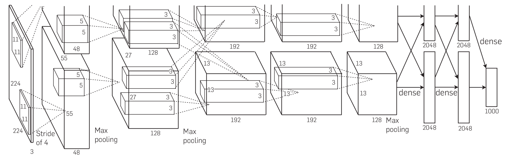

AlexNet
---

<!---->

本项目中的 AlexNet 使用 GPU 进行训练。 \
本项目上传了对应 ImageNet 数据集的网络结构和对应 MNIST 数据集的网络结构，并使用 MNIST 进行训练。 \
两种网络结构相同，根据不同数据集调整部分参数。

更新记录
---
2022.4.4 更新 ALexNet 论文代码（对应 ImageNet 数据集的网络结构）和对应 MNIST 数据集的网络结构，并使用 MNIST 进行训练。

注意
---
本项目合作单位：青岛科技大学 数据科学研究协会 \
Github Organization: https://github.com/QUST-DSRA

本项目遵循 MIT开源许可协议，转载请注明出处！

本项目收录大量博客、笔记资料，如有侵权请联系我，我将删除相关内容。\
邮箱：1583339587@qq.com
