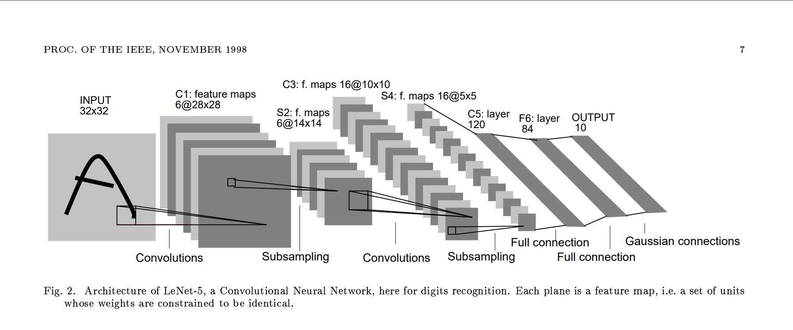
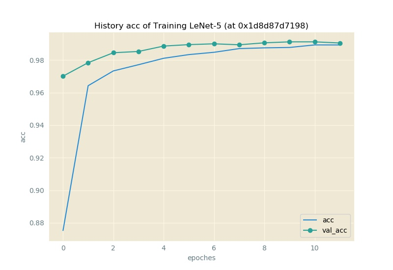
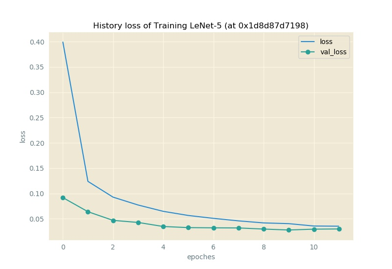

# `Keras`-implementations

于此存放的是, 各模型使用`tf1 backended Keras`进行的实现.

## `LeNet` 5

由 *Yann LeCun, Léon Bottou, Yoshua Bengio, Patrick Haffner* 于文献 **Gradient-Based Learning Applied to Document Recognition** 提出的用于识别手写数字的经典`convnet`.

* On IEEEXplore: [^1]
* On Yann LeCun's Own Website: <http://yann.lecun.com/exdb/publis/pdf/lecun-98.pdf>



于此使用`Keras`对其进行复现:

```py Python
lenet = keras.Sequential([
    keras.layers.Conv2D(filters=6, kernel_size=5, activation="relu", input_shape=Constants.INPUT_SHAPE, name="C1"),
    keras.layers.AvgPool2D(name="SP2"),
    keras.layers.Dropout(.25),
    keras.layers.Conv2D(16, 5, activation="relu", name="C3"),
    keras.layers.AvgPool2D(name="SP4"),
    keras.layers.Conv2D(120, 5, activation="relu", name="C5"),
    keras.layers.Flatten(),
    keras.layers.Dense(128, activation="relu", name="F6"),
    keras.layers.Dropout(.5),
    keras.layers.Dense(Constants.NUM_CLASSES, activation="softmax", name="Output"),
    ], name="LeNet-5")
lenet.compile(
        loss = keras.losses.categorical_crossentropy,
        optimizer = keras.optimizers.Adadelta(),
        metrics = ["accuracy"])
```

表现如下:

| `#` | `Keras` version | `TensorFlow` version | `Python` version | Hardware | Training time (/sec) | Testing Loss | Testing Acc |
|-----|-----------------|----------------------|------------------|----------|----------------------|--------------|-------------|
| I | 2.1.6 | 1.11.0 | 3.6.5 | NVIDIA GeForce `MX250` | 99.07298493385315 | 0.029901272440085995 | 0.9905 |



## References

[^1]: Y. LeCun, L. Bottou, Y. Bengio and P. Haffner, "Gradient-Based Learning Applied to Document Recognition", Proceedings of the IEEE, 86(11):2278-2324, November 1998, [doi: `10.1109/5.726791`](https://ieeexplore.ieee.org/document/726791)
