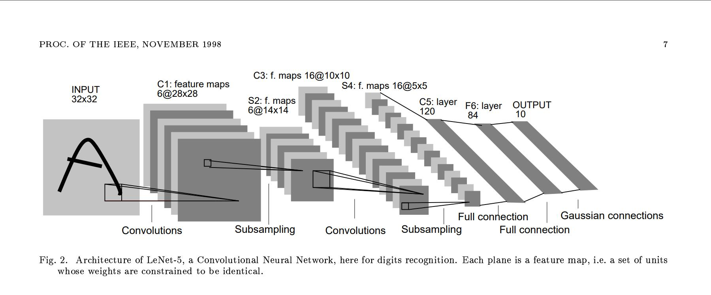

# `LeNet-5-Keras`

由 *Yann LeCun, Léon Bottou, Yoshua Bengio, Patrick Haffner* 于文献 **Gradient-Based Learning Applied to Document Recognition** 提出的用于识别手写数字的经典`convnet`.

于此存放的是, 其基于`tf1 backended Keras`的实现.

## Origin

* On IEEEXplore: [^1]
* On Yann LeCun's Own Website: <http://yann.lecun.com/exdb/publis/pdf/lecun-98.pdf>



## Implementation in `Keras`

于此使用`Keras`对其进行复现:

```py Python
lenet = keras.Sequential([
    keras.layers.Conv2D(filters=6, kernel_size=5, activation="relu", input_shape=Constants.INPUT_SHAPE, name="C1"),
    keras.layers.AvgPool2D(name="SP2"),
    keras.layers.Dropout(.25),
    keras.layers.Conv2D(16, 5, activation="relu", name="C3"),
    keras.layers.AvgPool2D(name="SP4"),
    keras.layers.Conv2D(120, 5, activation="relu", name="C5"),
    keras.layers.Flatten(),
    keras.layers.Dense(128, activation="relu", name="F6"),
    keras.layers.Dropout(.5),
    keras.layers.Dense(Constants.NUM_CLASSES, activation="softmax", name="Output"),
    ], name="LeNet-5")
lenet.compile(
        loss = keras.losses.categorical_crossentropy,
        optimizer = keras.optimizers.Adadelta(),
        metrics = ["accuracy"])
```

## Performance

| `#` | `Keras` version | `TensorFlow` version | `Python` version | Hardware | Training time (/sec) | Testing Loss | Testing Acc |
|-----|-----------------|----------------------|------------------|----------|----------------------|--------------|-------------|
| I | 2.1.6 | 1.11.0 | 3.6.5 | NVIDIA GeForce `MX250` | 99.07298493385315 | 0.029901272440085995 | 0.9905 |

## Output

```py
D:\Anaconda3\lib\site-packages\h5py\__init__.py:36: FutureWarning: Conversion of the second argument of issubdtype from `float` to `np.floating` is deprecated. In future, it will be treated as `np.float64 == np.dtype(float).type`.
  from ._conv import register_converters as _register_converters
Using TensorFlow backend.
Tensor Shape of each Image: (32, 32, 1)
Num of Training Samples: 60000
Num of Testing Samples: 10000
Train on 60000 samples, validate on 10000 samples
Epoch 1/12
2022-04-04 09:19:02.758125: I tensorflow/core/platform/cpu_feature_guard.cc:141] Your CPU supports instructions that this TensorFlow binary was not compiled to use: AVX AVX2
2022-04-04 09:19:03.446816: I tensorflow/core/common_runtime/gpu/gpu_device.cc:1411] Found device 0 with properties:
name: GeForce MX250 major: 6 minor: 1 memoryClockRate(GHz): 1.582
pciBusID: 0000:06:00.0
totalMemory: 2.00GiB freeMemory: 1.62GiB
2022-04-04 09:19:03.446939: I tensorflow/core/common_runtime/gpu/gpu_device.cc:1490] Adding visible gpu devices: 0
2022-04-04 09:19:04.362948: I tensorflow/core/common_runtime/gpu/gpu_device.cc:971] Device interconnect StreamExecutor with strength 1 edge matrix:
2022-04-04 09:19:04.363327: I tensorflow/core/common_runtime/gpu/gpu_device.cc:977]      0
2022-04-04 09:19:04.363596: I tensorflow/core/common_runtime/gpu/gpu_device.cc:990] 0:   N
2022-04-04 09:19:04.364251: I tensorflow/core/common_runtime/gpu/gpu_device.cc:1103] Created TensorFlow device (/job:localhost/replica:0/task:0/device:GPU:0 with 1370 MB memory) -> physical GPU (device: 0, name: GeForce MX250, pci bus id: 0000:06:00.0, compute capability: 6.1)
  128/60000 [..............................] - ETA: 33:04 - loss: 2.3040 - a
...
12928/60000 [=====>........................] - ETA: 20s - loss: 1.0472 - acc
...
59904/60000 [============================>.] - ETA: 0s - loss: 0.4003 - acc:
60000/60000 [==============================] - 12s 198us/step - loss: 0.4000 - acc: 0.8751 - val_loss: 0.0919 - val_acc: 0.9701
Epoch 2/12
  128/60000 [..............................] - ETA: 8s - loss: 0.1410 - acc:
60000/60000 [==============================] - 7s 117us/step - loss: 0.1239 - acc: 0.9642 - val_loss: 0.0640 - val_acc: 0.9784
Epoch 3/12
  128/60000 [..............................] - ETA: 7s - loss: 0.1421 - acc:
60000/60000 [==============================] - 8s 134us/step - loss: 0.0928 - acc: 0.9733 - val_loss: 0.0469 - val_acc: 0.9845
Epoch 4/12
  128/60000 [..............................] - ETA: 11s - loss: 0.0747 - acc
60000/60000 [==============================] - 9s 144us/step - loss: 0.0772 - acc: 0.9772 - val_loss: 0.0428 - val_acc: 0.9853
Epoch 5/12
  128/60000 [..............................] - ETA: 9s - loss: 0.0159 - acc:
60000/60000 [==============================] - 8s 140us/step - loss: 0.0647 - acc: 0.9811 - val_loss: 0.0348 - val_acc: 0.9886
Epoch 6/12
  128/60000 [..............................] - ETA: 5s - loss: 0.0187 - acc:
60000/60000 [==============================] - 8s 135us/step - loss: 0.0565 - acc: 0.9834 - val_loss: 0.0326 - val_acc: 0.9895
Epoch 7/12
  128/60000 [..............................] - ETA: 7s - loss: 0.0353 - acc:
60000/60000 [==============================] - 7s 117us/step - loss: 0.0508 - acc: 0.9848 - val_loss: 0.0321 - val_acc: 0.9900
Epoch 8/12
  128/60000 [..............................] - ETA: 7s - loss: 0.0077 - acc:
60000/60000 [==============================] - 7s 117us/step - loss: 0.0459 - acc: 0.9870 - val_loss: 0.0319 - val_acc: 0.9894
Epoch 9/12
  128/60000 [..............................] - ETA: 8s - loss: 0.0599 - acc:
60000/60000 [==============================] - 7s 118us/step - loss: 0.0418 - acc: 0.9875 - val_loss: 0.0297 - val_acc: 0.9906
Epoch 10/12
  128/60000 [..............................] - ETA: 8s - loss: 0.0243 - acc:
60000/60000 [==============================] - 7s 119us/step - loss: 0.0404 - acc: 0.9878 - val_loss: 0.0278 - val_acc: 0.9912
Epoch 11/12
  128/60000 [..............................] - ETA: 10s - loss: 0.0073 - acc
60000/60000 [==============================] - 8s 133us/step - loss: 0.0357 - acc: 0.9893 - val_loss: 0.0295 - val_acc: 0.9912
Epoch 12/12
  128/60000 [..............................] - ETA: 7s - loss: 0.0092 - acc:
60000/60000 [==============================] - 8s 135us/step - loss: 0.0353 - acc: 0.9893 - val_loss: 0.0299 - val_acc: 0.9905
10000/10000 [==============================] - 1s 145us/step
Training Time: 99.07298493385315
Testing Loss: 0.029901272440085995
Testing Accuracy: 0.9905
```

## Plotted Figures


## References

[^1]: Y. LeCun, L. Bottou, Y. Bengio and P. Haffner, "Gradient-Based Learning Applied to Document Recognition", Proceedings of the IEEE, 86(11):2278-2324, November 1998, [doi: `10.1109/5.726791`](https://ieeexplore.ieee.org/document/726791)
