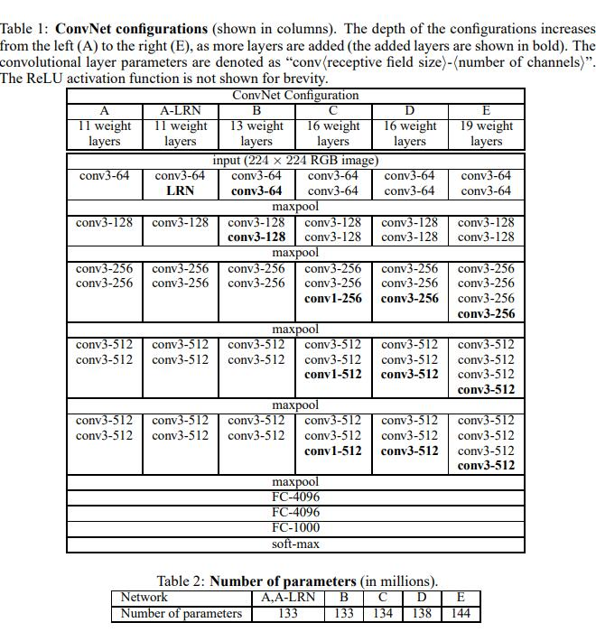
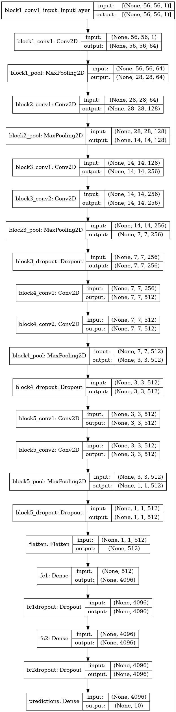
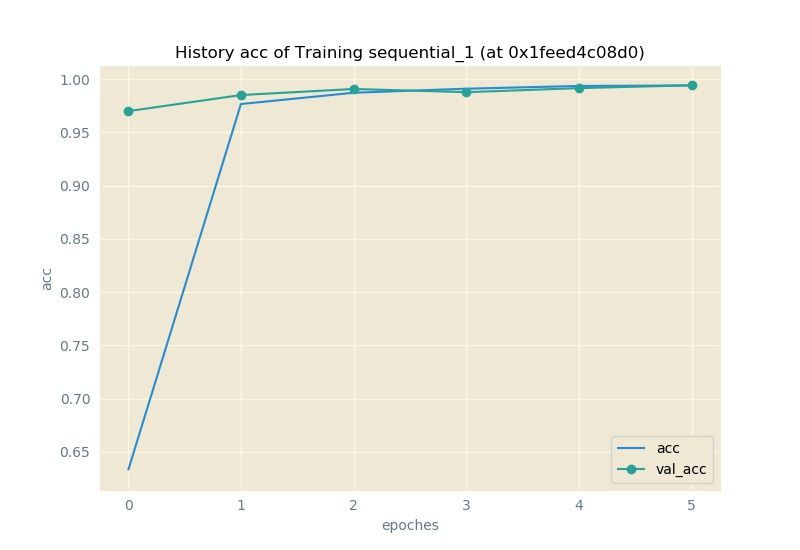
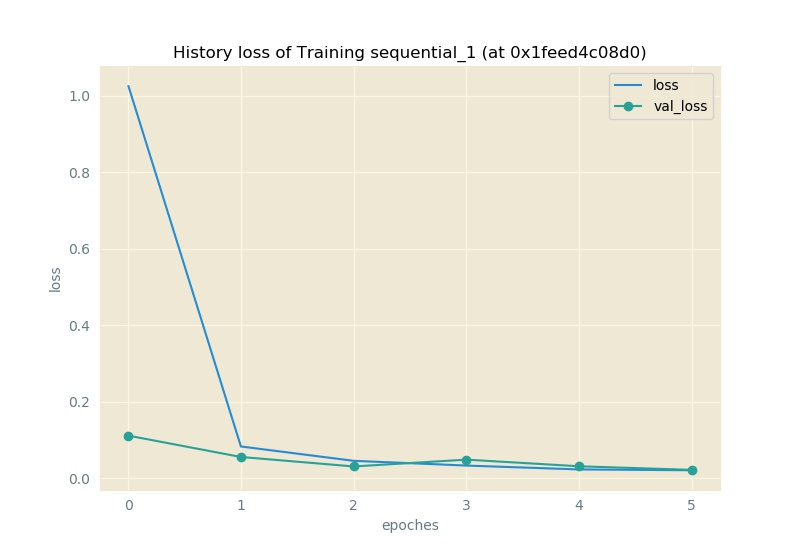

# `VGG11-Keras`

由 *Karen Simonyan, Andrew Zisserman* 于文献 **Very Deep Convolutional Networks for Large-Scale Image Recognition [^1]** 提出的超大型`convnet`, 为`ILSVRC2014`竞赛的第二名, 仅次于`GoogLeNet`.



于此存放的是, 其基于`tf1 backended Keras`的实现.

## Structure



## Implementation in `Keras`

于此使用`Keras`对其进行复现:

```py Python
vgg11 = keras.Sequential([
    keras.layers.Conv2D(filters=64, kernel_size=3, activation="relu", padding="same", input_shape=Constants.INPUT_SHAPE, name="block1_conv1"),
    keras.layers.MaxPool2D(name="block1_pool"),
    keras.layers.Conv2D(128, 3, activation="relu", padding="same", name="block2_conv1"),
    keras.layers.MaxPool2D(name="block2_pool"),
    keras.layers.Conv2D(256, 3, activation="relu", padding="same", name="block3_conv1"),
    keras.layers.Conv2D(256, 3, activation="relu", padding="same", name="block3_conv2"),
    keras.layers.MaxPool2D(name="block3_pool"),
    keras.layers.Dropout(.2, name="block3_dropout"),
    keras.layers.Conv2D(512, 3, activation="relu", padding="same", name="block4_conv1"),
    keras.layers.Conv2D(512, 3, activation="relu", padding="same", name="block4_conv2"),
    keras.layers.MaxPool2D(name="block4_pool"),
    keras.layers.Dropout(.2, name="block4_dropout"),
    keras.layers.Conv2D(512, 3, activation="relu", padding="same", name="block5_conv1"),
    keras.layers.Conv2D(512, 3, activation="relu", padding="same", name="block5_conv2"),
    keras.layers.MaxPool2D(name="block5_pool"),
    keras.layers.Dropout(.2, name="block5_dropout"),
    keras.layers.Flatten(name="flatten"),
    keras.layers.Dense(4096, activation="relu", name="fc1"),
    keras.layers.Dropout(.2, name="fc1dropout"),
    keras.layers.Dense(4096, activation="relu", name="fc2"),
    keras.layers.Dropout(.2, name="fc2dropout"),
    keras.layers.Dense(Constants.NUM_CLASSES, activation="softmax", name="predictions")
    ])
vgg11.compile(
        loss = keras.losses.categorical_crossentropy,
        optimizer = keras.optimizers.Adadelta(),
        metrics = ["accuracy"])
```

## Performance

| `#` | `Keras` version | `TensorFlow` version | `Python` version | Hardware | Training time (/sec) | Testing Loss | Testing Acc |
|-----|-----------------|----------------------|------------------|----------|----------------------|--------------|-------------|
| I | 2.1.6 | 1.11.0 | 3.6.5 | NVIDIA GeForce `MX250` | 1335.9403011798859 | 0.02176549677590374 | 0.9942 |

## Output

```py
D:\Anaconda3\lib\site-packages\h5py\__init__.py:36: FutureWarning: Conversion of the second argument of issubdtype from `float` to `np.floating` is deprecated. In future, it will be treated as `np.float64 == np.dtype(float).type`.
  from ._conv import register_converters as _register_converters
Using TensorFlow backend.
Tensor Shape of each Image: (56, 56, 1)
Num of Training Samples: 60000
Num of Testing Samples: 10000
Train on 60000 samples, validate on 10000 samples
Epoch 1/6
2022-04-06 08:28:26.552109: I tensorflow/core/platform/cpu_feature_guard.cc:141] Your CPU supports instructions that this TensorFlow binary was not compiled to use: AVX AVX2
2022-04-06 08:28:26.684116: I tensorflow/core/common_runtime/gpu/gpu_device.cc:1411] Found device 0 with properties:
name: GeForce MX250 major: 6 minor: 1 memoryClockRate(GHz): 1.582
pciBusID: 0000:06:00.0
totalMemory: 2.00GiB freeMemory: 1.62GiB
2022-04-06 08:28:26.684753: I tensorflow/core/common_runtime/gpu/gpu_device.cc:1490] Adding visible gpu devices: 0
2022-04-06 08:28:29.230099: I tensorflow/core/common_runtime/gpu/gpu_device.cc:971] Device interconnect StreamExecutor with strength 1 edge matrix:
2022-04-06 08:28:29.230445: I tensorflow/core/common_runtime/gpu/gpu_device.cc:977]      0
2022-04-06 08:28:29.230683: I tensorflow/core/common_runtime/gpu/gpu_device.cc:990] 0:   N
2022-04-06 08:28:29.232815: I tensorflow/core/common_runtime/gpu/gpu_device.cc:1103] Created TensorFlow device (/job:localhost/replica:0/task:0/device:GPU:0 with 1370 MB memory) -> physical GPU (device: 0, name: GeForce MX250, pci bus id: 0000:06:00.0, compute capability: 6.1)
2022-04-06 08:28:36.675997: W tensorflow/core/common_runtime/bfc_allocator.cc:215] Allocator (GPU_0_bfc) ran out of memory trying to allocate 544.02MiB. The caller indicates that this is not a failure, but may mean that there could be performance gains if more memory were available.
2022-04-06 08:28:36.812625: W tensorflow/core/common_runtime/bfc_allocator.cc:215] Allocator (GPU_0_bfc) ran out of memory trying to allocate 364.50MiB. The caller indicates that this is not a failure, but may mean that there could be performance gains if more memory were available.
2022-04-06 08:28:36.837373: W tensorflow/core/common_runtime/bfc_allocator.cc:215] Allocator (GPU_0_bfc) ran out of memory trying to allocate 952.02MiB. The caller indicates that this is not a failure, but may mean that there could be performance gains if more memory were available.
2022-04-06 08:28:36.977901: W tensorflow/core/common_runtime/bfc_allocator.cc:215] Allocator (GPU_0_bfc) ran out of memory trying to allocate 729.00MiB. The caller indicates that this is not a failure, but may mean that there could be performance gains if more memory were available.
2022-04-06 08:28:37.025124: W tensorflow/core/common_runtime/bfc_allocator.cc:215] Allocator (GPU_0_bfc) ran out of memory trying to allocate 1.59GiB. The caller indicates that this is not a failure, but may mean that there could be performance gains if more memory were available.
2022-04-06 08:28:37.118494: W tensorflow/core/common_runtime/bfc_allocator.cc:215] Allocator (GPU_0_bfc) ran out of memory trying to allocate 729.00MiB. The caller indicates that this is not a failure, but may mean that there could be performance gains if more memory were available.
2022-04-06 08:28:37.142077: W tensorflow/core/common_runtime/bfc_allocator.cc:215] Allocator (GPU_0_bfc) ran out of memory trying to allocate 1.59GiB. The caller indicates that this is not a failure, but may mean that there could be performance gains if more memory were available.
2022-04-06 08:28:37.342117: W tensorflow/core/common_runtime/bfc_allocator.cc:215] Allocator (GPU_0_bfc) ran out of memormance gains if more memory were available.
2022-04-06 08:28:37.403103: W tensorflow/core/common_runtime/bfc_allocator.cc:215] Allocator (GPU_0_bfc) ran out of memory trying to allocate 729.00MiB. The caller indicates that this is not a failure, but may mean that there could be performance gains if more memory were available.
2022-04-06 08:28:37.403478: W tensorflow/core/common_runtime/bfc_allocator.cc:215] Allocator (GPU_0_bfc) ran out of memory trying to allocate 1.59GiB. The caller indicates that this is not a failure, but may mean that there could be performance gains if more memory were available.
60000/60000 [==============================] - 228s 4ms/step - loss: 1.0274 - acc: 0.6329 - val_loss: 0.1113 - val_acc: 0.9699
Epoch 2/6
60000/60000 [==============================] - 216s 4ms/step - loss: 0.0829 - acc: 0.9766 - val_loss: 0.0555 - val_acc:
Epoch 3/6
60000/60000 [==============================] - 223s 4ms/step - loss: 0.0454 - acc: 0.9872 - val_loss: 0.0307 - val_acc: 0.9907
Epoch 4/6
60000/60000 [==============================] - 218s 4ms/step - loss: 0.0330 - acc: 0.9910 - val_loss: 0.0485 - val_acc: 0.9877
Epoch 5/6
60000/60000 [==============================] - 217s 4ms/step - loss: 0.0229 - acc: 0.9935 - val_loss: 0.0311 - val_acc:
Epoch 6/6
60000/60000 [==============================] - 219s 4ms/step - loss: 0.0208 - acc: 0.9940 - val_loss: 0.0218 - val_acc: 0.9942
10000/10000 [==============================] - 13s 1ms/step
Training Time: 1335.9403011798859
Testing Loss: 0.02176549677590374
Testing Accuracy: 0.9942
```

## Plotted Figures



## References

[^1]:
